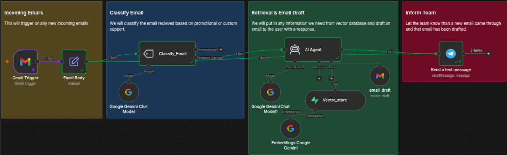
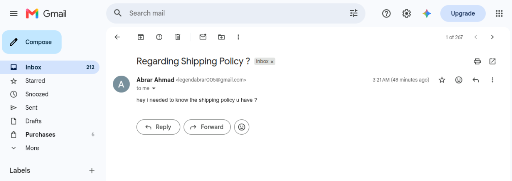
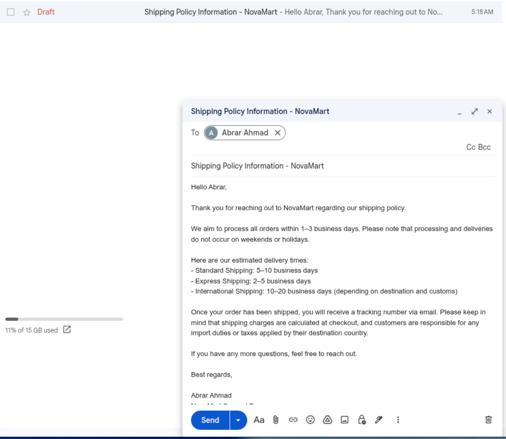
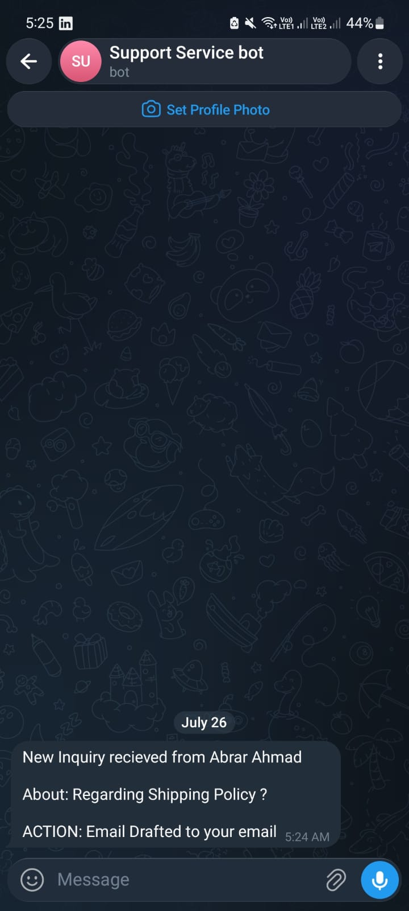

# 📧 Customer Support AI Agent

An AI-powered customer support automation workflow built with **n8n**, **Google Gemini**, and **Supabase Vector Database**. The system automatically processes incoming customer emails, classifies them, retrieves relevant knowledge using semantic search, drafts professional responses, and notifies the support team via Telegram.

---

## 🚀 Features

- 📥 Automatically monitors incoming Gmail messages
- 🧠 AI-powered email classification
  - Customer Support
  - Promotional / Marketing
- 🔍 Retrieval-Augmented Generation (RAG)
  - Searches a Supabase Vector Database for relevant company knowledge
- ✍️ Generates professional email drafts using Google Gemini
- 📬 Saves the response as a Gmail draft for human review
- 📱 Sends a Telegram notification when the draft is ready
- ⚡ Fully automated workflow built in n8n

---

# 🏗 Workflow

```text
Incoming Email
       │
       ▼
 Gmail Trigger
       │
       ▼
 Extract Email Details
       │
       ▼
 AI Email Classification
       │
       ├──────────────► Promotional
       │                  (Ignored)
       │
       ▼
 Customer Support Query
       │
       ▼
 Search Supabase Vector Database
       │
       ▼
 Google Gemini
       │
       ▼
 Generate Email Draft
       │
       ▼
 Save Gmail Draft
       │
       ▼
 Telegram Notification
```

---

# 🛠 Tech Stack

| Category | Technology |
|----------|------------|
| Workflow Automation | n8n |
| LLM | Google Gemini |
| Vector Database | Supabase |
| Embeddings | Gemini Embeddings |
| Email | Gmail API |
| Notifications | Telegram Bot API |
| AI Classification | Gemini |
| Knowledge Retrieval | Vector Search (RAG) |

---

# 📂 Repository Structure

```
Customer-Support-AI-Agent/
│
├── workflow/
│   └── Customer_Support_AI_Agent.json
│
├── screenshots/
│   ├── workflow.png
│   ├── client-email.png
│   ├── ai-draft.png
│   └── telegram-notification.png
│
└── README.md
```

---

# 📸 Demo

## 1. Complete Automation Workflow

The complete n8n workflow responsible for email processing, AI classification, retrieval, drafting, and notifications.



---

## 2. Incoming Customer Email

Example of a customer support inquiry received through Gmail.



---

## 3. AI Generated Email Draft

After retrieving relevant information from the vector database, Gemini generates a professional response and saves it as a Gmail draft for review.

<p align="center">
  
</p>

---

## 4. Telegram Notification

Once the draft is prepared, the workflow sends an instant Telegram notification to inform the support team.

<p align="center">
  
</p>

---

# ⚙️ How It Works

### Step 1 — Email Monitoring

The workflow continuously monitors incoming Gmail messages.

### Step 2 — Email Classification

Gemini determines whether the email is:

- Customer Support
- Promotional

Only support-related emails continue through the workflow.

### Step 3 — Knowledge Retrieval

The customer's query is searched against a **Supabase Vector Database** containing company knowledge and documentation.

### Step 4 — AI Draft Generation

Gemini uses the retrieved context to generate an accurate and professional email response.

### Step 5 — Gmail Draft

Instead of sending automatically, the response is saved as a Gmail draft, allowing a human to review it before sending.

### Step 6 — Telegram Alert

A Telegram message is sent notifying the support team that the draft is ready.

---

# 🎯 Use Cases

- Customer Support Automation
- AI Help Desk
- Internal Knowledge Base Assistant
- E-commerce Support
- SaaS Customer Service
- IT Helpdesk Automation

---
